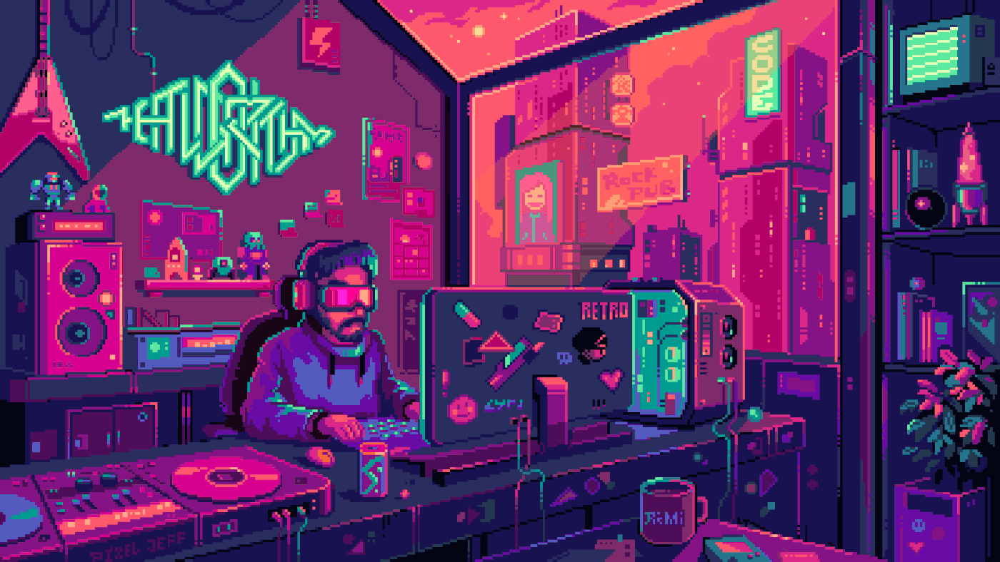

<body>
  
  <section class="section">
    

      

        <h1>⚡HELLO I'M ASHWIN⚡</h1>
        
        
        
      

    

  </section>
  <!-- Neon Divider -->

  

  <section class="section">
    <!-- Neon Divider -->
    

    <h2>🌐 Socials</h2>
    

      
      
      
      
    

    
    

  </section>

  <section class="section">
    

    <h2>💻 Tech Stack</h2>
    

      
      
      
      
      
      
      
      
      
      
      
      
      
      
      
      
      
      
      
      
      
      
      
      
      
      
      
      
    

    
    

  </section>

  <section class="section stats">
    

    <h2>📊 GitHub Stats</h2>
    
    
    
    
    

  </section>

  

</body>
</html>
